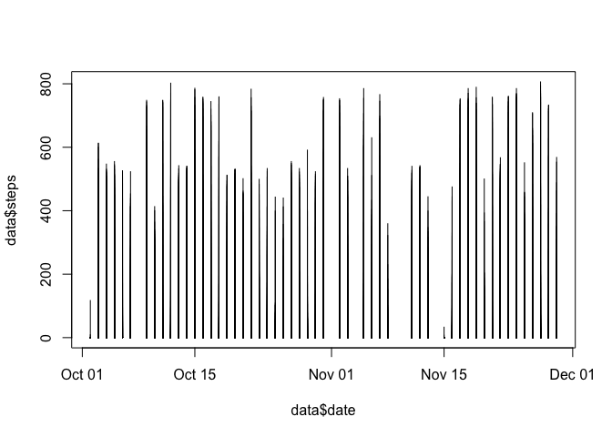
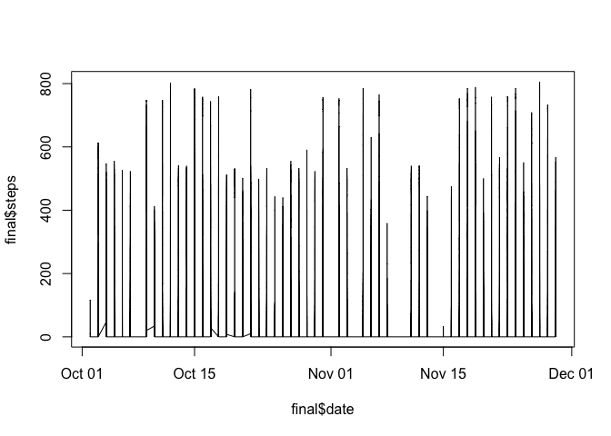

## Loading and preprocessing the data

```r
raw <- read.csv("activity.csv", header = TRUE, sep = ",", na.strings = "NA")
raw <- mutate(raw, date = as.Date(date, "%Y-%m-%d"))
data <- na.omit(raw)
```
## What is mean total number of steps taken per day?

```r
aggregate(data$steps, by=list(data$date), FUN=sum)
```

```
##       Group.1     x
## 1  2012-10-02   126
## 2  2012-10-03 11352
## 3  2012-10-04 12116
## 4  2012-10-05 13294
## 5  2012-10-06 15420
## 6  2012-10-07 11015
## 7  2012-10-09 12811
## 8  2012-10-10  9900
## 9  2012-10-11 10304
## 10 2012-10-12 17382
## 11 2012-10-13 12426
## 12 2012-10-14 15098
## 13 2012-10-15 10139
## 14 2012-10-16 15084
## 15 2012-10-17 13452
## 16 2012-10-18 10056
## 17 2012-10-19 11829
## 18 2012-10-20 10395
## 19 2012-10-21  8821
## 20 2012-10-22 13460
## 21 2012-10-23  8918
## 22 2012-10-24  8355
## 23 2012-10-25  2492
## 24 2012-10-26  6778
## 25 2012-10-27 10119
## 26 2012-10-28 11458
## 27 2012-10-29  5018
## 28 2012-10-30  9819
## 29 2012-10-31 15414
## 30 2012-11-02 10600
## 31 2012-11-03 10571
## 32 2012-11-05 10439
## 33 2012-11-06  8334
## 34 2012-11-07 12883
## 35 2012-11-08  3219
## 36 2012-11-11 12608
## 37 2012-11-12 10765
## 38 2012-11-13  7336
## 39 2012-11-15    41
## 40 2012-11-16  5441
## 41 2012-11-17 14339
## 42 2012-11-18 15110
## 43 2012-11-19  8841
## 44 2012-11-20  4472
## 45 2012-11-21 12787
## 46 2012-11-22 20427
## 47 2012-11-23 21194
## 48 2012-11-24 14478
## 49 2012-11-25 11834
## 50 2012-11-26 11162
## 51 2012-11-27 13646
## 52 2012-11-28 10183
## 53 2012-11-29  7047
```

```r
plot(data$steps ~ data$date, type = "h")
```

<!-- -->

```r
aggregate(data$steps, by=list(data$date), FUN=mean)
```

```
##       Group.1          x
## 1  2012-10-02  0.4375000
## 2  2012-10-03 39.4166667
## 3  2012-10-04 42.0694444
## 4  2012-10-05 46.1597222
## 5  2012-10-06 53.5416667
## 6  2012-10-07 38.2465278
## 7  2012-10-09 44.4826389
## 8  2012-10-10 34.3750000
## 9  2012-10-11 35.7777778
## 10 2012-10-12 60.3541667
## 11 2012-10-13 43.1458333
## 12 2012-10-14 52.4236111
## 13 2012-10-15 35.2048611
## 14 2012-10-16 52.3750000
## 15 2012-10-17 46.7083333
## 16 2012-10-18 34.9166667
## 17 2012-10-19 41.0729167
## 18 2012-10-20 36.0937500
## 19 2012-10-21 30.6284722
## 20 2012-10-22 46.7361111
## 21 2012-10-23 30.9652778
## 22 2012-10-24 29.0104167
## 23 2012-10-25  8.6527778
## 24 2012-10-26 23.5347222
## 25 2012-10-27 35.1354167
## 26 2012-10-28 39.7847222
## 27 2012-10-29 17.4236111
## 28 2012-10-30 34.0937500
## 29 2012-10-31 53.5208333
## 30 2012-11-02 36.8055556
## 31 2012-11-03 36.7048611
## 32 2012-11-05 36.2465278
## 33 2012-11-06 28.9375000
## 34 2012-11-07 44.7326389
## 35 2012-11-08 11.1770833
## 36 2012-11-11 43.7777778
## 37 2012-11-12 37.3784722
## 38 2012-11-13 25.4722222
## 39 2012-11-15  0.1423611
## 40 2012-11-16 18.8923611
## 41 2012-11-17 49.7881944
## 42 2012-11-18 52.4652778
## 43 2012-11-19 30.6979167
## 44 2012-11-20 15.5277778
## 45 2012-11-21 44.3993056
## 46 2012-11-22 70.9270833
## 47 2012-11-23 73.5902778
## 48 2012-11-24 50.2708333
## 49 2012-11-25 41.0902778
## 50 2012-11-26 38.7569444
## 51 2012-11-27 47.3819444
## 52 2012-11-28 35.3576389
## 53 2012-11-29 24.4687500
```

```r
aggregate(data$steps, by=list(data$date), FUN=median)
```

```
##       Group.1 x
## 1  2012-10-02 0
## 2  2012-10-03 0
## 3  2012-10-04 0
## 4  2012-10-05 0
## 5  2012-10-06 0
## 6  2012-10-07 0
## 7  2012-10-09 0
## 8  2012-10-10 0
## 9  2012-10-11 0
## 10 2012-10-12 0
## 11 2012-10-13 0
## 12 2012-10-14 0
## 13 2012-10-15 0
## 14 2012-10-16 0
## 15 2012-10-17 0
## 16 2012-10-18 0
## 17 2012-10-19 0
## 18 2012-10-20 0
## 19 2012-10-21 0
## 20 2012-10-22 0
## 21 2012-10-23 0
## 22 2012-10-24 0
## 23 2012-10-25 0
## 24 2012-10-26 0
## 25 2012-10-27 0
## 26 2012-10-28 0
## 27 2012-10-29 0
## 28 2012-10-30 0
## 29 2012-10-31 0
## 30 2012-11-02 0
## 31 2012-11-03 0
## 32 2012-11-05 0
## 33 2012-11-06 0
## 34 2012-11-07 0
## 35 2012-11-08 0
## 36 2012-11-11 0
## 37 2012-11-12 0
## 38 2012-11-13 0
## 39 2012-11-15 0
## 40 2012-11-16 0
## 41 2012-11-17 0
## 42 2012-11-18 0
## 43 2012-11-19 0
## 44 2012-11-20 0
## 45 2012-11-21 0
## 46 2012-11-22 0
## 47 2012-11-23 0
## 48 2012-11-24 0
## 49 2012-11-25 0
## 50 2012-11-26 0
## 51 2012-11-27 0
## 52 2012-11-28 0
## 53 2012-11-29 0
```
## What is the average daily activity pattern?

```r
plot(data$steps ~ data$interval, type = "l")
```

<!-- -->

```r
data[data$steps == max(data$steps),]
```

```
##       steps       date interval
## 16492   806 2012-11-27      615
```
## Imputing missing values

```r
sum(is.na(raw$steps))
```

```
## [1] 2304
```

```r
new <- raw
new[is.na(new)] <- 0

plot(data$steps ~ data$date, type = "h")
```

<!-- -->

```r
aggregate(new$steps, by=list(new$date), FUN=mean)
```

```
##       Group.1          x
## 1  2012-10-01  0.0000000
## 2  2012-10-02  0.4375000
## 3  2012-10-03 39.4166667
## 4  2012-10-04 42.0694444
## 5  2012-10-05 46.1597222
## 6  2012-10-06 53.5416667
## 7  2012-10-07 38.2465278
## 8  2012-10-08  0.0000000
## 9  2012-10-09 44.4826389
## 10 2012-10-10 34.3750000
## 11 2012-10-11 35.7777778
## 12 2012-10-12 60.3541667
## 13 2012-10-13 43.1458333
## 14 2012-10-14 52.4236111
## 15 2012-10-15 35.2048611
## 16 2012-10-16 52.3750000
## 17 2012-10-17 46.7083333
## 18 2012-10-18 34.9166667
## 19 2012-10-19 41.0729167
## 20 2012-10-20 36.0937500
## 21 2012-10-21 30.6284722
## 22 2012-10-22 46.7361111
## 23 2012-10-23 30.9652778
## 24 2012-10-24 29.0104167
## 25 2012-10-25  8.6527778
## 26 2012-10-26 23.5347222
## 27 2012-10-27 35.1354167
## 28 2012-10-28 39.7847222
## 29 2012-10-29 17.4236111
## 30 2012-10-30 34.0937500
## 31 2012-10-31 53.5208333
## 32 2012-11-01  0.0000000
## 33 2012-11-02 36.8055556
## 34 2012-11-03 36.7048611
## 35 2012-11-04  0.0000000
## 36 2012-11-05 36.2465278
## 37 2012-11-06 28.9375000
## 38 2012-11-07 44.7326389
## 39 2012-11-08 11.1770833
## 40 2012-11-09  0.0000000
## 41 2012-11-10  0.0000000
## 42 2012-11-11 43.7777778
## 43 2012-11-12 37.3784722
## 44 2012-11-13 25.4722222
## 45 2012-11-14  0.0000000
## 46 2012-11-15  0.1423611
## 47 2012-11-16 18.8923611
## 48 2012-11-17 49.7881944
## 49 2012-11-18 52.4652778
## 50 2012-11-19 30.6979167
## 51 2012-11-20 15.5277778
## 52 2012-11-21 44.3993056
## 53 2012-11-22 70.9270833
## 54 2012-11-23 73.5902778
## 55 2012-11-24 50.2708333
## 56 2012-11-25 41.0902778
## 57 2012-11-26 38.7569444
## 58 2012-11-27 47.3819444
## 59 2012-11-28 35.3576389
## 60 2012-11-29 24.4687500
## 61 2012-11-30  0.0000000
```
## Are there differences in activity patterns between weekdays and weekends?

```r
final <- mutate(data, weekday = weekdays(date) %in% c("Monday", "Tuesday", "Wednesday", "Thursday", "Friday"))
plot(final$date, final$steps, type = "l", col = final$weekday)
```

<!-- -->
